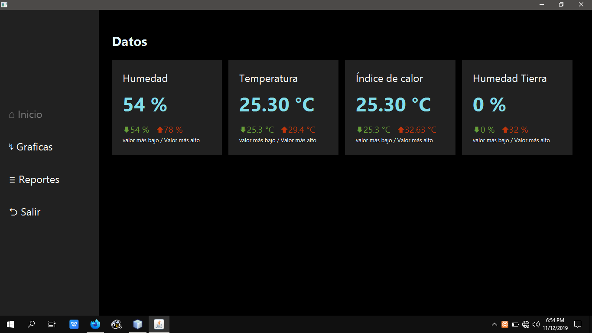
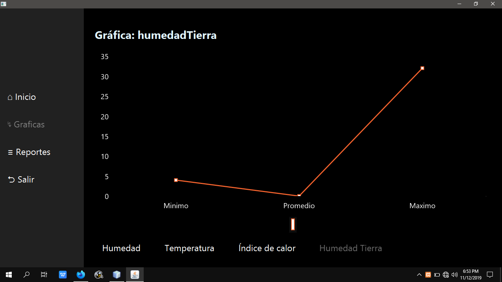
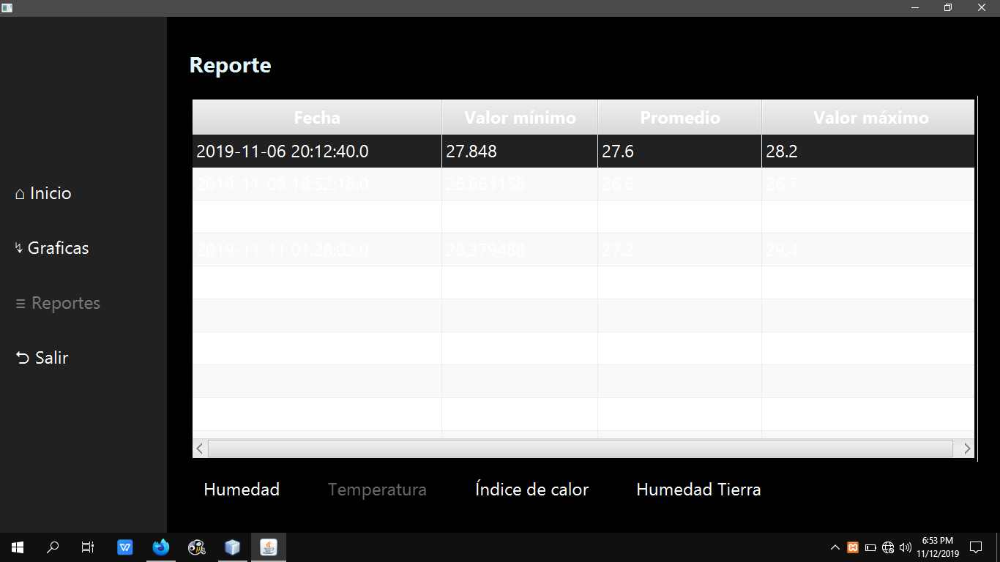

# HOME CLIMATE WITH ARDUINO
The application consists of displaying data obtained from sensors connected to an arduino.

## Sensors and modules
* Arduino Mega 2560
* Bluetooth HC-06
* DHT11
* FC-28
* LDR
* PIR
* Passive buzzer

## Screenshots

